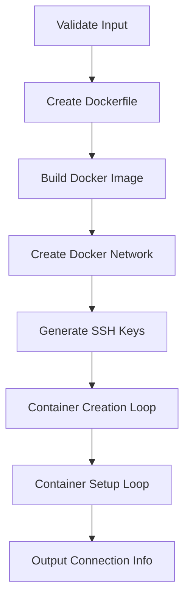

# N02 Linux Cluster - Technical Documentation

This document provides comprehensive technical documentation for the N02 Linux Cluster codebase, including architecture, implementation details, and design decisions.

## Table of Contents

- [Project Overview](#project-overview)
- [Codebase Structure](#codebase-structure)
- [Architecture & Design](#architecture--design)
- [Implementation Details](#implementation-details)
- [Configuration & Constants](#configuration--constants)
- [Error Handling & Edge Cases](#error-handling--edge-cases)
- [Security Considerations](#security-considerations)
- [Performance Characteristics](#performance-characteristics)
- [Maintenance & Extensibility](#maintenance--extensibility)

## Project Overview

**N02 Linux Cluster** is a Bash-based automation tool that creates Docker container-based Linux clusters for educational and experimental purposes. The project focuses on simplicity, reliability, and ease of use for distributed computing experiments.

### Key Objectives

- Provide a reproducible Linux cluster environment
- Enable SSH-based connectivity between cluster nodes
- Support parallel command execution across nodes
- Maintain clean separation between host and cluster environments

## Codebase Structure

```
n02-linux-cluster/
├── N02.sh                 # Main cluster creation script
├── connectivity_demo.sh   # Cluster connectivity testing
├── cleanup.sh            # Resource cleanup script
├── README.md             # User documentation
├── CODEBASE_DOCS.md      # This technical documentation
├── Dockerfile            # Generated container image definition
├── id_rsa_cluster        # Generated SSH private key
└── id_rsa_cluster.pub    # Generated SSH public key
```

### File Responsibilities

| File                   | Purpose                            | Key Functions                             |
| ---------------------- | ---------------------------------- | ----------------------------------------- |
| `N02.sh`               | Cluster creation and configuration | `main()`, container setup loops           |
| `connectivity_demo.sh` | Connectivity verification          | Parallel SSH testing, host key management |
| `cleanup.sh`           | Resource cleanup                   | Docker resource removal                   |
| `README.md`            | User documentation                 | Installation, usage examples              |
| `Dockerfile`           | Container image definition         | Ubuntu base + SSH server                  |
| SSH keys               | Authentication                     | Passwordless SSH access                   |

## Architecture & Design

### Core Architecture

The system follows a **host-managed container cluster** architecture:

```
┌─────────────────┐
│   Host Machine  │
│                 │
│  ┌────────────┐ │
│  │   N02.sh   │ │  ← Script execution
│  └────────────┘ │
│        │        │
│    Docker API   │  ← Container management
│        │        │
│  ┌────────────┐ │
│  │ Containers │ │  ← Cluster nodes
│  │   comp1    │ │
│  │   comp2    │ │
│  │    ...     │ │
│  └────────────┘ │
└─────────────────┘
```

### Design Principles

1. **Immutability**: Fresh containers and networks for each run
2. **Isolation**: Dedicated Docker network for cluster communication
3. **Security**: SSH key-based authentication, no password access
4. **Simplicity**: Single-command cluster creation and destruction
5. **Observability**: Built-in connectivity testing and logging

### Key Design Decisions

#### Docker Network Design

- **Custom bridge network**: `cluster-network` with subnet `172.20.0.0/16`
- **Static IP assignment**: Predictable addressing (172.20.0.11, 172.20.0.12, ...)
- **Gateway isolation**: Prevents interference with host networking

#### SSH Architecture

- **Single key pair**: Shared across all containers for simplicity
- **Host-based auth**: Keys distributed during container setup
- **Port mapping**: Sequential host ports (2222, 2223, ...) for external access

#### Container Configuration

- **Ubuntu 22.04 base**: Stable LTS with good package support
- **Minimal footprint**: Only essential packages (openssh-server, pssh, sudo)
- **User isolation**: Non-root `student` user for SSH access

## Implementation Details

### N02.sh - Main Script Flow

The main script follows a sequential execution model:



#### Phase 1: Validation & Preparation (Lines 8-34)

```bash
# Input validation
if [ $# -eq 0 ]; then
    echo "Usage: $0 <N>"
    exit 1
fi

# Positive integer check using regex
if ! [[ "$N" =~ ^[1-9][0-9]*$ ]]; then
    echo "Error: N must be a positive integer"
    exit 1
fi
```

#### Phase 2: Infrastructure Creation (Lines 35-74)

- **Dockerfile Generation**: Dynamic Dockerfile creation with variable substitution
- **Image Building**: `docker build` with Ubuntu 22.04 + SSH server
- **Network Setup**: Bridge network with custom subnet and gateway
- **SSH Key Generation**: RSA 4096-bit keys with empty passphrase

#### Phase 3: Container Orchestration (Lines 75-143)

**Container Creation Loop:**

```bash
for ((i=1; i<=N; i++)); do
    CONTAINER_NAME="comp${i}"
    IP_ADDR="172.20.0.$(($i + 10))"  # 172.20.0.11, .12, ...
    HOST_PORT="$(($i + 2221))"       # 2222, 2223, ...

    # Cleanup existing containers
    docker stop "${CONTAINER_NAME}" &>/dev/null || true
    docker rm "${CONTAINER_NAME}" &>/dev/null || true

    # Create container with hostname, network, and port mapping
    docker run -d \
        --name "${CONTAINER_NAME}" \
        --hostname "${CONTAINER_NAME}" \
        --network "${NETWORK_NAME}" \
        --ip "${IP_ADDR}" \
        -p "${HOST_PORT}":22 \
        "${IMAGE_NAME}"
done
```

**Container Configuration Loop:**
Each container undergoes setup including:

- SSH public key deployment
- Private key distribution (for inter-container SSH)
- Package installation (pssh for parallel execution)
- Hostname resolution configuration

### Connectivity Testing Architecture

The `connectivity_demo.sh` script implements a comprehensive testing strategy:

#### Host-to-Container Testing

```bash
for ((i=1; i<=N; i++)); do
    HOST_PORT=$((i + 2221))
    ssh -i "${PRIVATE_KEY}" ${HOST_KEY_CHECK} -p "${HOST_PORT}" \
        "${SSH_USER}@localhost" "echo 'Connection successful: \$(hostname)'"
done
```

#### Inter-Container Testing

Uses nested SSH calls with parallel-ssh for comprehensive connectivity matrix testing. SSH known_hosts are pre-populated during cluster setup to eliminate host key warnings.

### Cleanup Strategy

The `cleanup.sh` script implements a systematic cleanup approach:

1. **Container Removal**: Stop and remove all `comp*` containers
2. **Network Cleanup**: Remove cluster network
3. **Image Removal**: Clean up Docker images
4. **Key Cleanup**: Remove generated SSH keys
5. **File Cleanup**: Remove generated Dockerfile and temporary files
6. **SSH Known Hosts Cleanup**: Restore or clean host SSH known_hosts file (removes cluster entries to prevent key conflicts)

## Configuration & Constants

### Hardcoded Values

| Constant       | Value                | Purpose                 | Rationale                          |
| -------------- | -------------------- | ----------------------- | ---------------------------------- |
| `IMAGE_NAME`   | `"linux-ssh-server"` | Docker image identifier | Descriptive and unique             |
| `SSH_USER`     | `"student"`          | Container username      | Educational context                |
| `KEY_NAME`     | `"id_rsa_cluster"`   | SSH key filename        | Cluster-specific naming            |
| `NETWORK_NAME` | `"cluster-network"`  | Docker network name     | Clear purpose indication           |
| `SUBNET`       | `"172.20.0.0/16"`    | Network range           | Private IP space, avoids conflicts |
| `GATEWAY`      | `"172.20.0.1"`       | Network gateway         | Standard first IP in subnet        |

### Port Mapping Logic

```bash
BASE_PORT=2221
HOST_PORT="$(($i + ${BASE_PORT}))"  # i=1 → 2222, i=2 → 2223, etc.
```

### IP Address Assignment

```bash
BASE_IP=10
IP_ADDR="172.20.0.$(($i + ${BASE_IP}))"  # i=1 → 172.20.0.11, etc.
```

## Error Handling & Edge Cases

### Input Validation

- **Missing arguments**: Script exits with usage message
- **Invalid N**: Regex validation ensures positive integers only
- **Non-numeric input**: Regex pattern `^[1-9][0-9]*$` prevents leading zeros and negative numbers

### Docker Error Handling

- **Container conflicts**: Pre-removal of existing containers with `|| true`
- **Network conflicts**: Network removal before creation
- **Build failures**: Docker build errors propagate to script failure

### SSH Connectivity Issues

- **Host key verification**: Pre-populated known_hosts prevents key verification warnings
- **Key conflict resolution**: Existing keys are removed before adding new ones during setup
- **Known hosts cleanup**: Comprehensive removal of cluster entries during cleanup
- **Connection timeouts**: Commands use `2>/dev/null` for silent failure handling

### Resource Management

- **Cleanup on failure**: Partial cleanup not implemented (by design for debugging)
- **Idempotent operations**: Scripts can be run multiple times safely
- **Resource leaks**: Cleanup script handles all generated resources

## Security Considerations

### Authentication

- **SSH key-based**: No password authentication enabled
- **Shared key pair**: Simplifies management but reduces security
- **Key permissions**: Proper file permissions (600 for private, 644 for public)

### Network Security

- **Isolated network**: Bridge network prevents host interference
- **No external exposure**: Containers only accessible via port mapping
- **Internal communication**: Full mesh connectivity within cluster

### Container Security

- **Non-root user**: SSH access through unprivileged `student` account
- **Minimal packages**: Only essential software installed
- **No persistent data**: Containers are ephemeral by design

## Performance Characteristics

### Time Complexity

- **Setup time**: O(N) - linear scaling with cluster size
- **Network creation**: O(1) - constant time
- **SSH key distribution**: O(N²) - each key copied to each container
- **Connectivity testing**: O(N²) - all pairs tested

### Space Complexity

- **Docker images**: ~200MB base Ubuntu + SSH (~50MB incremental)
- **Container storage**: Minimal, ephemeral containers
- **SSH keys**: ~8KB total for key pair
- **Generated files**: ~1KB for Dockerfile

### Bottlenecks

- **Docker image building**: I/O bound, cached after first run
- **Container startup**: Network-bound for package downloads
- **SSH connections**: Latency-sensitive for large clusters

### Optimizations Implemented

- **Parallel container creation**: All containers started simultaneously
- **Package pre-installation**: pssh baked into Docker image
- **Efficient cleanup**: Batch operations where possible

## Maintenance & Extensibility

### Code Organization

- **Single responsibility**: Each script has one primary function
- **Modular design**: Configuration constants at top of files
- **Consistent naming**: Descriptive variable names and functions
- **Error handling**: Graceful failure with informative messages

### Extension Points

- **Container customization**: Dockerfile generation allows package additions
- **Network configuration**: Subnet and gateway easily modifiable
- **Authentication methods**: SSH key logic can be extended
- **Testing frameworks**: Connectivity demo extensible for additional tests

### Testing Strategy

- **Integration testing**: Connectivity verification built-in
- **Manual testing**: README provides usage examples
- **Error case testing**: Input validation and cleanup testing

### Future Enhancements

- **Configuration files**: External configuration support
- **Container orchestration**: Kubernetes integration possibility
- **Monitoring**: Resource usage tracking
- **Security hardening**: SELinux/AppArmor integration

## Development Notes

### Bash Best Practices Followed

- **Error handling**: `set -e` not used (intentional for partial failure debugging)
- **Variable quoting**: All variables properly quoted
- **Command substitution**: Modern `$()` syntax used
- **Arithmetic expansion**: `$(( ))` for calculations

### Debugging Support

- **Verbose output**: Step-by-step progress reporting
- **Error messages**: Descriptive failure information
- **Cleanup preservation**: Failed runs leave containers for inspection
- **Logging**: All operations logged to stdout

### Compatibility

- **Docker versions**: Tested with Docker 20.x+
- **Bash versions**: Compatible with Bash 4.x+
- **Host systems**: Linux/macOS/Windows (with WSL2)
- **Ubuntu versions**: Designed for Ubuntu 22.04 LTS

---

_This documentation is maintained alongside the codebase. Last updated: $(date)_
